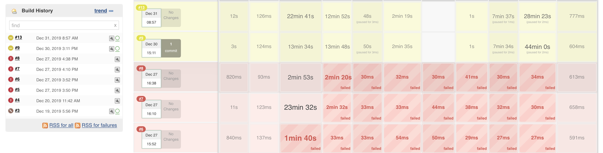
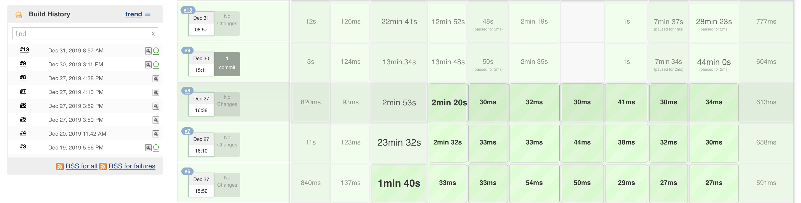
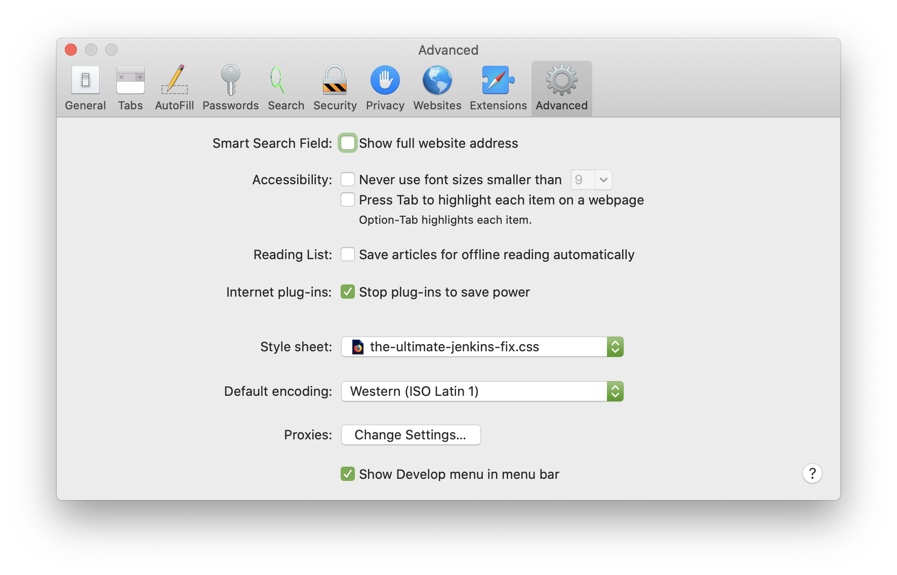

The Ultimate Jenkins Fix
========================

Are you still at work, struggling with the Jenkins, desperately trying to fix your build? Been there, done that...

The New Year is a magic time, time to make people happy. And here is a special gift for you!

The Ultimate Jenkins Fix. It magically and instantaneously fixes all issues across all the Jenkins pipelines, branches and builds. The fix works even with the past builds!

Here is an example of the Ultimate Jenkins Fix in action:

As you can see, the Jenkins is all green, all the failures and instabilities are fixed even for the past builds!

How to setup The Ultimate Jenkins Fix in Safari
-----------------------------------------------

To download The Ultimate Jenkins Fix:

1. Right click on the [The Ultimate Jenkins Fix](the-ultimate-jenkins-fix.css)
2. In the pop-up menu select `Download linked file`

The file will be downloaded to your `Downloads` folder.

To install the Ultimate Jenkins Fix:

1. Open `Safari`
2. Press `Command + ,` or choose `Safari > Preferences...` from the menu.
3. Select `Advanced` tab.
4. In the `Style sheet` drop down list select `Other`
5. Navigate to your `Downloads` folder and choose the `the-ultimate-jenkins-fix.css`

    

Voila! All your Jenkins issues are magically solved!

How to setup The Ultimate Jenkins Fix in Firefox/Chrome
-------------------------------------------------------

The setup process should be straightforward and similar to Safari above. Please contribute the setup instructions for other browsers and operating systems.

**If you find this fix helpful, please star and share the repo, spread the word!**
